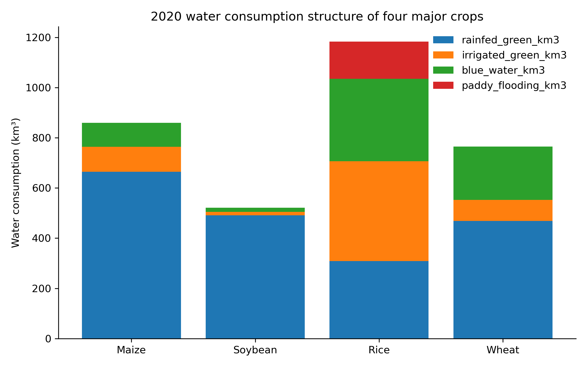
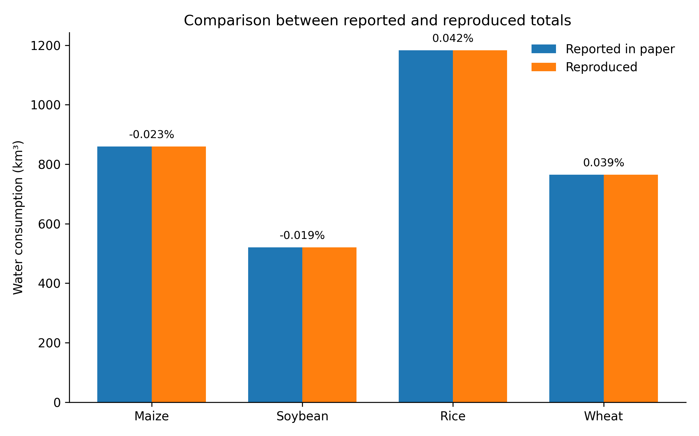
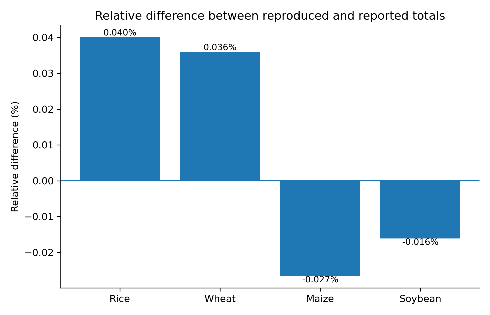

# 项目概述

本项目围绕 CropGBWater 项目的结果可复现性开展评估。复现对象为发表在 *Nature Food* 的论文：*Global spatially explicit crop water consumption shows an overall increase of 9% for 46 agricultural crops from 2010 to 2020*。

本项目不尝试完整复现全部 46 种作物和所有年份，而是选择一个明确、可检查、可运行的局部复现目标：基于作者公开的 Data_S4 2020 年格点结果文件，复现 Maize、Soybean、Rice 和 Wheat 四种主要作物的全球蓝水与绿水消耗总量，并与论文主文报告值进行对照。

# 复现目标

本项目重点复现四种作物 2020 年全球总水消耗，并区分以下组成部分：

* 雨养绿水；
* 灌溉绿水；
* 蓝水；
* Rice 的稻田淹灌附加水耗。

# 数据与代码闭环

本项目将四个 Data_S4 原始格点 CSV 文件直接放入仓库：

```text
data/raw/Data_S4_four_crops/
├── Data_S4_Y2020_WF_Maize_grid_avg.csv
├── Data_S4_Y2020_WF_Rice_grid_avg.csv
├── Data_S4_Y2020_WF_Soybean_grid_avg.csv
└── Data_S4_Y2020_WF_Wheat_grid_avg.csv
```

运行以下命令即可从原始 Data_S4 文件重新生成 processed 数据、结果表和图件：

```bash
python code/run_all.py
```

该命令会依次运行：

```text
00_check_required_data.py
01_prepare_four_crop_data.py
02_calculate_totals.py
03_make_figures.py
04_error_analysis.py
05_reproducibility_check.py
```

# 快速复现

```bash
git clone https://github.com/D2RS-2026spring/CropGBWater-reproducibility.git
cd CropGBWater-reproducibility
pip install -r requirements.txt
python code/run_all.py
```

运行完成后，主要输出包括：

```text
data/processed/four_crop_2020_water_consumption.csv
data/processed/four_crop_2020_water_components_long.csv
outputs/tables/four_crop_reproduction_summary.csv
outputs/tables/error_analysis_summary.csv
outputs/tables/reproducibility_check.csv
outputs/figures/fig1_water_structure.png
outputs/figures/fig2_reproduced_vs_reported.png
outputs/figures/fig3_relative_error.png
```

# 图 1 四种作物水消耗结构



# 图 2 论文报告值与本组复现值对照



# 图 3 相对误差



# 主要结果

本组基于 Data_S4 原始格点结果重新汇总得到的四种作物 2020 年全球总水消耗与论文主文报告值高度一致：

* Maize：复现值约 859.77 km³，论文报告值约 860 km³，相对误差约 -0.027%。
* Soybean：复现值约 520.92 km³，论文报告值约 521 km³，相对误差约 -0.016%。
* Rice：复现值约 1183.47 km³，论文报告值约 1183 km³，相对误差约 0.040%。
* Wheat：复现值约 765.27 km³，论文报告值约 765 km³，相对误差约 0.036%。

四种作物的相对误差均小于 0.05%，说明在 2020 年四种关键作物全球总量这一局部目标上，CropGBWater 公开结果具有较高的结果可复现性。

# 独立复现测试

本项目已进行独立 clone 测试。测试流程为：

```bash
git clone https://github.com/D2RS-2026spring/CropGBWater-reproducibility.git
cd CropGBWater-reproducibility
pip install -r requirements.txt
python code/run_all.py
```

测试结果表明，仓库可以从内置的四个 Data_S4 原始 CSV 文件重新生成 processed 数据、结果表和图件。运行最终输出为：

```text
All required files exist.
All reproduction steps completed.
```

# 可复现性评价

从当前局部复现结果看，CropGBWater 项目在关键结果数据公开性方面表现较好。作者公开的 Data_S4 格点结果能够支持四种关键作物 2020 年全球总量的独立汇总与结果校验。

本项目当前实现的是“结果数据层面的局部复现”，即基于作者公开的标准格点输出重新汇总主文关键结果。它不等同于完整运行 CropGBWater 原始逐日模型。

# 局限性

本项目尚未完整复现全部 46 种作物、2010—2020 年全部年度、完整逐日 CropGBWater 原始模型和所有空间中间变量。该设计的目的是在课程项目范围内构建一个小而完整、可检查、可运行的复现工作流。
